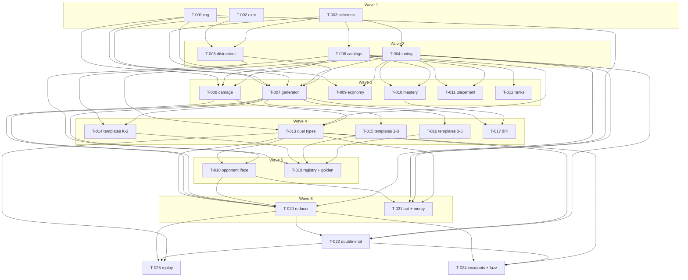

# Tickets — Cannon Academy engine + content core

**Scope:** `src/engine/**` and `src/content/**` only (pure TypeScript, headless-verifiable).
`app/**`, `src/components/**`, `src/stores/**`, `src/services/**`, EAS, art, and audio are out of
this swarm's scope per `.tdd-swarm/posture.md` and cannot be gated in this environment.

**24 tickets · 8 waves.** Every ticket cites a PRD / ARCHITECTURE section in `traces_to`.
Requirement coverage and planning gaps: `.tdd-swarm/traceability.md`.

Status values: `backlog → tests-written → in-progress → review-passed → done` (`blocked` from any
active state). Only the orchestrator writes them. `github_issue` is `null` throughout — the
GitHub mirror is **SKIPPED** under `.tdd-swarm/posture.md` (no remote repo); ticket files are the
source of truth.

---

## Wave 1 — foundations (no dependencies)

| id | title | status | deps | branch | model | issue |
|----|-------|--------|------|--------|-------|-------|
| T-001 | Seeded mulberry32 PRNG with pure, state-threaded draw helpers | backlog | — | `ticket/T-001-seeded-prng` | standard | — |
| T-002 | Safe arithmetic expression and constraint predicate evaluator (no eval) | backlog | — | `ticket/T-002-safe-expr-eval` | capable | — |
| T-003 | Content zod schemas, id unions, and engine question types | backlog | — | `ticket/T-003-schemas-and-types` | standard | — |

## Wave 2 — constants, distractors, catalog data

| id | title | status | deps | branch | model | issue |
|----|-------|--------|------|--------|-------|-------|
| T-004 | Central tuning constants — every magic number in one file | backlog | T-003 | `ticket/T-004-tuning` | standard | — |
| T-005 | Distractor construction and plausibility validation | backlog | T-002, T-003 | `ticket/T-005-distractors` | capable | — |
| T-006 | Catalog data (skills, cannons, islands, ranks, crew) and validated loaders | backlog | T-003 | `ticket/T-006-catalogs` | standard | — |

## Wave 3 — the pure rule modules

| id | title | status | deps | branch | model | issue |
|----|-------|--------|------|--------|-------|-------|
| T-007 | Question generator — selection, rejection sampling, render, four-choice assembly | backlog | T-001, T-002, T-003, T-004, T-005 | `ticket/T-007-question-generator` | capable | — |
| T-008 | Damage model — answer quality, biased roll, perfect shot, volatile recoil | backlog | T-001, T-003, T-004, T-006 | `ticket/T-008-damage-model` | capable | — |
| T-009 | Economy — performance coin payout and seeded chest rarity roll | backlog | T-001, T-003, T-004 | `ticket/T-009-economy` | standard | — |
| T-010 | Mastery — dual-rate meters, threshold, and unlock resolution | backlog | T-003, T-004, T-006 | `ticket/T-010-mastery` | standard | — |
| T-011 | Grade-band placement — pre-unlocked islands, cannons, starting bot band | backlog | T-003, T-004, T-006 | `ticket/T-011-placement` | cheap | — |
| T-012 | Rank ladder — numeric tier from wins, ratcheted so a loss never demotes | backlog | T-003, T-006 | `ticket/T-012-rank-ladder` | cheap | — |

## Wave 4 — duel vocabulary, template content, the drill loop

| id | title | status | deps | branch | model | issue |
|----|-------|--------|------|--------|-------|-------|
| T-013 | Duel state, events, action log, and initial-state construction | backlog | T-001, T-003, T-004, T-006, T-008 | `ticket/T-013-duel-types` | standard | — |
| T-014 | Question templates — K–2 addition and subtraction (symbolic only) | backlog | T-001, T-003, T-004, T-005, T-007 | `ticket/T-014-templates-k2-addsub` | standard | — |
| T-015 | Question templates — grade 2–3 place value, two-step add/sub, mult facts | backlog | T-001, T-003, T-004, T-005, T-007 | `ticket/T-015-templates-g23` | standard | — |
| T-016 | Question templates — grade 3–5 division, fractions, multi-digit / order of ops | backlog | T-001, T-003, T-004, T-005, T-007 | `ticket/T-016-templates-g35` | capable | — |
| T-017 | Gunnery-range drill session — full-rate mastery practice loop | backlog | T-001, T-003, T-004, T-007, T-010 | `ticket/T-017-range-drill` | standard | — |

## Wave 5 — opponent seam and the golden gate

| id | title | status | deps | branch | model | issue |
|----|-------|--------|------|--------|-------|-------|
| T-018 | Opponent interface and scripted onboarding rival | backlog | T-003, T-006, T-013 | `ticket/T-018-opponent-interface` | standard | — |
| T-019 | Template registry and the catalog-wide golden conformance suite | backlog | T-003, T-006, T-007, T-014, T-015, T-016 | `ticket/T-019-template-registry-golden` | standard | — |

## Wave 6 — the duel machine

| id | title | status | deps | branch | model | issue |
|----|-------|--------|------|--------|-------|-------|
| T-020 | Duel reducer — the pure turn-based state machine | backlog | T-004, T-007, T-008, T-013, T-018 | `ticket/T-020-duel-reducer` | capable | — |
| T-021 | Banded bot opponent and built-in mercy | backlog | T-001, T-003, T-004, T-006, T-013, T-018 | `ticket/T-021-bot-and-mercy` | capable | — |

## Wave 7 — machine extension

| id | title | status | deps | branch | model | issue |
|----|-------|--------|------|--------|-------|-------|
| T-022 | Double-Shot — opt into a shortened timer for a multi-volley turn | backlog | T-004, T-013, T-020 | `ticket/T-022-double-shot` | capable | — |

## Wave 8 — proofs over the finished machine

| id | title | status | deps | branch | model | issue |
|----|-------|--------|------|--------|-------|-------|
| T-023 | Duel replay — reconstruct a duel from seed plus the ordered action log | backlog | T-013, T-020, T-022 | `ticket/T-023-duel-replay` | capable | — |
| T-024 | Duel invariants and the random-event-stream fuzz test | backlog | T-013, T-020, T-022 | `ticket/T-024-duel-invariants` | capable | — |

## Blocked

| id | reason | attempts | needs |
|----|--------|----------|-------|
| — | none | — | — |

---

## Dependency graph

---

## Wave plan and parallelism

| wave | tickets | width | critical path node | notes |
|---|---|---|---|---|
| 1 | T-001, T-002, T-003 | 3 | T-003 | Zero dependencies. `T-003` is the type vocabulary everything else imports; `T-002` is the largest single ticket in the wave (a parser). |
| 2 | T-004, T-005, T-006 | 3 | T-004 / T-006 | `T-004` is the honesty boundary — every unspecified number is named here with behaviour-pinned ACs. |
| 3 | T-007, T-008, T-009, T-010, T-011, T-012 | 6 | T-007 | Widest wave. Six independent pure modules; `T-011` and `T-012` are `cheap` and will finish early. |
| 4 | T-013, T-014, T-015, T-016, T-017 | 5 | T-013 | The three template tickets are heavy content authoring with 1,000-sample sweeps each; `T-013` gates all of waves 5–8. |
| 5 | T-018, T-019 | 2 | T-018 | `T-019` is the project's highest-value gate (`.tdd-swarm/posture.md`) but is off the critical path. |
| 6 | T-020, T-021 | 2 | T-020 | `T-020` is the largest ticket in the run (22 ACs). |
| 7 | T-022 | 1 | T-022 | Sole owner of `duel/types.ts` + `duel/reducer.ts` in this wave — this is why it is alone. |
| 8 | T-023, T-024 | 2 | — | Both prove properties of the finished machine; neither may edit it. |

**Critical path (8 hops):** `T-003 → T-004 → T-008 → T-013 → T-018 → T-020 → T-022 → T-023/T-024`.

### File-scope exclusivity

Verified mechanically: no two tickets in the same wave declare an overlapping `file_scopes` entry.
Exactly two files are touched by more than one ticket, both across waves and both intentional:

| file | owners | why |
|---|---|---|
| `src/engine/duel/types.ts` | T-013 (w4), T-022 (w7) | T-022 additively extends the event union and the `reload` phase for Double-Shot |
| `src/engine/duel/reducer.ts` | T-020 (w6), T-022 (w7) | same — T-022's AC-1 requires T-013's and T-020's frozen tests to pass unmodified |

### Notes for the orchestrator

- `T-004`'s ACs deliberately pin **bounds, ordering, and monotonicity** rather than values for
  every number PLAN.md and ARCHITECTURE.md leave unspecified. Do not let a reviewer "tighten"
  those into exact-value assertions — the open questions in `.tdd-swarm/traceability.md` must be
  answered by the human first.
- `T-014` / `T-015` / `T-016` each run ~1,000 seeded samples per template; `T-019` repeats the
  sweep over the whole registry. Both budgets are capped at 60s in their DoD.
- No ticket has an `Eval` row in its Test Plan. There is no LLM anywhere in this codebase; every
  module here is a pure function of its inputs and a seed.
