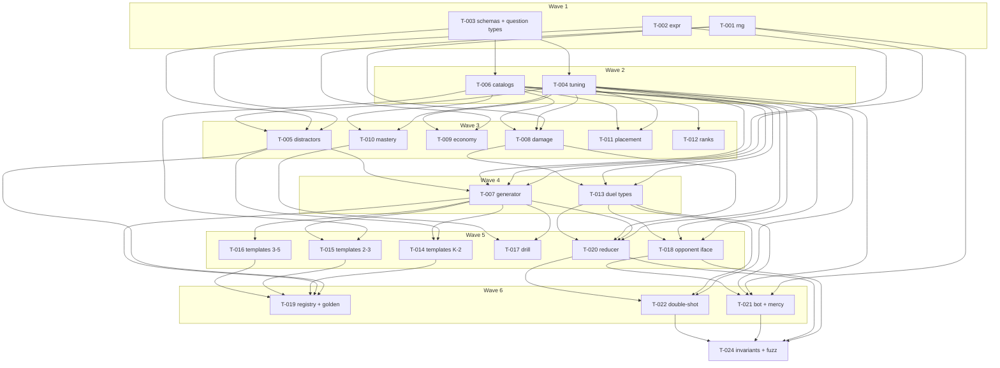

# Tickets — Cannon Academy engine + content core

**Scope:** `src/engine/**` and `src/content/**` only (pure TypeScript, headless-verifiable).
`app/**`, `src/components/**`, `src/stores/**`, `src/services/**`, EAS, art, and audio are out of
this swarm's scope per `.tdd-swarm/posture.md` and cannot be gated in this environment.

**23 tickets · 7 waves · 338 acceptance criteria.** Every ticket cites a PRD / ARCHITECTURE
section in `traces_to`. Requirement coverage, open questions, and planning gaps:
`.tdd-swarm/traceability.md`.

> **Revision 3** — owner rulings D-1…D-5 applied at the Phase 1 checkpoint, 2026-07-27.
> `T-023` (`duel/replay.ts`) is **cut**; its replay proof moved into T-024 as AC-19–AC-22,
> including the negative control. Four open questions are now **closed decisions**, recorded and
> dated in each ticket's Planning Decisions so they are not reopened: template floor of 8 (D-1),
> Double-Shot as a shortened timer (D-2), `culverin.recoilDamage = 0` (D-3), and Reliable ≡
> Standard at the damage layer (D-4). 24 → 23 tickets; wave count unchanged at 7.
>
> **Revision 2** (post adversarial plan review). Two Critical and eight Important findings fixed;
> the wave count went 8 → 7. The material changes: `T-005` now declares its real `T-004`
> dependency (it was a dispatch-time compile failure), `T-008`'s damage curve was **corrected**
> rather than reworded so the 0.35 floor binds the roll instead of only the quality input, and the
> phantom `T-018 → T-020` edge was dropped in favour of driving the opponent seam through T-024's
> fuzz. See the revision log at the bottom.

Status values: `backlog → tests-written → in-progress → review-passed → done` (`blocked` from any
active state). Only the orchestrator writes them. `github_issue` is `null` throughout — the
GitHub mirror is **SKIPPED** under `.tdd-swarm/posture.md` (no remote repo); ticket files are the
source of truth.

---

## Wave 1 — foundations (no dependencies)

**Merged into `swarm/engine-core` (`1eb9cf8..ac34693`) — integration PASS.** Three clean merges,
all repo gates green, **492/492 tests**, `npm audit` clean, manifests unchanged. Cross-module
integration probe green. One Minor architecture finding open (distractor count, see below).
Evidence: `.tdd-swarm/reports/wave1-integration.md`.

| id    | title                                                                   | status        | deps | branch                           | model    | issue |
| ----- | ----------------------------------------------------------------------- | ------------- | ---- | -------------------------------- | -------- | ----- |
| T-001 | Seeded mulberry32 PRNG with pure, state-threaded draw helpers           | review-passed | —    | `ticket/T-001-seeded-prng`       | standard | —     |
| T-002 | Safe arithmetic expression and constraint predicate evaluator (no eval) | review-passed | —    | `ticket/T-002-safe-expr-eval`    | capable  | —     |
| T-003 | Content zod schemas, id unions, and engine question types               | review-passed | —    | `ticket/T-003-schemas-and-types` | standard | —     |

> **~~Open Minor finding (owner decision required, T-003).~~ CLOSED by T-026 in wave 2.**
> `templateSchema` allowed `.min(3)` distractors; ARCHITECTURE.md §4.1 specifies exactly three
> ("four-choice taps, universally"). A 4-distractor template parsed, then failed later at
> `assertQuestion` with `INVALID_QUESTION`. Origin was the ticket spec (`T-003.md:58`, AC-4 =
> "at least three"), not the implementation. The owner chose the "tighten to `.length(3)` and
> re-freeze" resolution; T-026 shipped it and the wave-2 integration probe confirmed the
> invariant now fails at content-validation time, where §4.1 put the catch.

## Wave 2 — constants and catalog data

**Merged into `swarm/engine-core` (`c5a3fc9..5ec09f6`) — integration PASS.** Three clean merges,
all repo gates green, **776/776 tests**, `npm audit` clean, manifests byte-identical. Cross-ticket
integration probe green (19/19), including the headline three-volley onboarding fix verified
against T-006's real catalog numbers. One Minor architecture finding open (`CHOICE_COUNT`
duplication, see below). Evidence: `.tdd-swarm/reports/wave2-integration.md`.

| id    | title                                                                      | status        | deps  | branch                           | model    | issue |
| ----- | -------------------------------------------------------------------------- | ------------- | ----- | -------------------------------- | -------- | ----- |
| T-004 | Central tuning constants — every magic number in one file                  | review-passed | T-003 | `ticket/T-004-tuning`            | standard | —     |
| T-006 | Catalog data (skills, cannons, islands, ranks, crew) and validated loaders | review-passed | T-003 | `ticket/T-006-catalogs`          | standard | —     |
| T-026 | templateSchema must require exactly three distractors                      | review-passed | T-003 | `ticket/T-026-exact-distractors` | cheap    | —     |

> **Open Minor finding (owner decision required, T-003 × T-004).** `CHOICE_COUNT = 4` now has two
> homes: `src/engine/tuning.ts:120` (exported, T-004) and `src/engine/questions/types.ts:44`
> (module-local, T-003). ARCHITECTURE.md §4.3/§8 require one file for every magic number, and
> `T-004.md:50` claims `CHOICE_COUNT` for `tuning.ts`. Correct when T-003 shipped (no `tuning.ts`
> existed); the wave-2 merge creates the duplication, and no ticket is assigned to collapse it.
> Nothing is broken today — both hold `4` — but moving the value on §4.3's dev slider would leave
> `assertQuestion` validating against a stale literal and throwing `INVALID_QUESTION` on every
> question, defeating the capability the one-file rule exists to protect. Fix is one line
> (`types.ts` imports from `@engine/tuning`), but re-opens a review-passed wave-1 file with
> frozen tests, so it needs the owner's call.

## Wave 3 — the pure rule modules

| id    | title                                                                      | status        | deps                       | branch                      | model    | issue |
| ----- | -------------------------------------------------------------------------- | ------------- | -------------------------- | --------------------------- | -------- | ----- |
| T-005 | Distractor construction and plausibility validation                        | review-passed | T-002, T-003, T-004        | `ticket/T-005-distractors`  | capable  | —     |
| T-008 | Damage model — answer quality, floored roll, perfect shot, volatile recoil | review-passed | T-001, T-003, T-004, T-006 | `ticket/T-008-damage-model` | capable  | —     |
| T-009 | Economy — performance coin payout and seeded chest rarity roll             | review-passed | T-001, T-003, T-004        | `ticket/T-009-economy`      | standard | —     |
| T-010 | Mastery — dual-rate meters, threshold, and unlock resolution               | review-passed | T-003, T-004, T-006        | `ticket/T-010-mastery`      | standard | —     |
| T-011 | Grade-band placement — pre-unlocked islands, cannons, starting bot band    | review-passed | T-003, T-004, T-006        | `ticket/T-011-placement`    | cheap    | —     |
| T-012 | Rank ladder — numeric tier from wins, ratcheted so a loss never demotes    | review-passed | T-003, T-006               | `ticket/T-012-rank-ladder`  | cheap    | —     |

**Wave 3 merged 2026-07-28** — `e8155ad..786abf7`, six clean merges, **1,229 tests passing**, all
gates green. Integration report: `.tdd-swarm/reports/wave3-integration.md`. The wave is **PASS**;
two findings were escalated rather than absorbed and filed as `T-032` and `T-033` below. Neither
blocks the merge; both should close before wave 4 dispatches.

## Wave 4 — generator and duel vocabulary

**Merged into `swarm/engine-core` (`b5b666f..c0b11ca`) — integration PASS.** Two clean merges,
all repo gates green, **1,438/1,438 tests**, `npm audit` clean, manifests byte-identical.
Cross-ticket probe green (T-007 × T-013). Evidence: `.tdd-swarm/reports/wave4-integration.md`.

| id    | title                                                                            | status | deps                              | branch                            | model    | issue                                               |
| ----- | -------------------------------------------------------------------------------- | ------ | --------------------------------- | --------------------------------- | -------- | --------------------------------------------------- |
| T-007 | Question generator — selection, rejection sampling, render, four-choice assembly | done   | T-001, T-002, T-003, T-004, T-005 | `ticket/T-007-question-generator` | capable  | frozen `1a586570…`; impl `a358270`; merge `63a4388` |
| T-013 | Duel state, events, action log, and initial-state construction                   | done   | T-001, T-003, T-004, T-006, T-008 | `ticket/T-013-duel-types`         | standard | frozen `767fc8da…`; impl `f99b25f`; merge `c0b11ca` |

## Wave 5 — template content, drill, opponents, the duel machine

| id    | title                                                                          | status | deps                                     | branch                                  | model    | issue                                                                               |
| ----- | ------------------------------------------------------------------------------ | ------ | ---------------------------------------- | --------------------------------------- | -------- | ----------------------------------------------------------------------------------- |
| T-014 | Question templates — K–2 addition and subtraction (symbolic only)              | done   | T-001, T-003, T-004, T-005, T-007        | `ticket/T-014-templates-k2-addsub`      | standard | frozen `9c239b355136e2b3…`; merge landed; security PASS                             |
| T-015 | Question templates — grade 2–3 place value, two-step add/sub, mult facts       | done   | T-001, T-003, T-004, T-005, T-006, T-007 | `ticket/T-015-templates-g23`            | standard | frozen `a987150c86df4bc8…` DoD-7 sibling fix; merge landed; security PASS           |
| T-016 | Question templates — grade 3–5 division, fractions, multi-digit / order of ops | done   | T-001, T-003, T-004, T-005, T-007        | `ticket/T-016-templates-g35`            | capable  | frozen `e50a87a3e9cc7bf3…` DoD-7 sibling fix `8d01118`; merge landed; security PASS |
| T-017 | Gunnery-range drill session — full-rate mastery practice loop                  | done   | T-001, T-003, T-004, T-007, T-010        | `ticket/T-017-range-drill`              | standard | frozen `7db026f6…`; impl `2572fbd`; merge landed; security PASS_WITH_NOTES          |
| T-018 | Opponent interface and scripted onboarding rival                               | done   | T-003, T-004, T-006, T-013               | `ticket/T-018-onboarding-rival`         | standard | frozen `344d3091…`; impl `702a804`; merge landed; security PASS_WITH_NOTES          |
| T-020 | Duel reducer — the pure turn-based state machine                               | done   | T-004, T-006, T-007, T-008, T-013        | `ticket/T-020-duel-reducer`             | capable  | frozen `80c4cdb1…`; impl `6ef7aaf`; merge landed; security PASS_WITH_NOTES          |
| T-032 | Placement grants starter cannons only (D-6)                                    | done   | T-010, T-011                             | `ticket/T-032-placement-unlock-overlap` | standard | D-6; impl `ff66b32`; merge landed; security PASS                                    |
| T-034 | Narrow template param keys to the expression-identifier grammar                | done   | T-003                                    | `ticket/T-034-param-key-grammar`        | standard | frozen `fcf0e43f…`; impl `9947577`; merge landed; security PASS_WITH_NOTES          |
| T-035 | Export duel tray capacity (`TRAY_CAPACITY`) in tuning                          | done   | T-004                                    | `ticket/T-035-tray-capacity`            | standard | frozen `b994d1f714e4b150…`; unblocks A-011; T-030 consumes constant                 |

## Wave 6 — golden gate, mercy bot, machine extension

| id    | title                                                            | status  | deps                                            | branch                                  | model    | issue |
| ----- | ---------------------------------------------------------------- | ------- | ----------------------------------------------- | --------------------------------------- | -------- | ----- |
| T-019 | Template registry and the catalog-wide golden conformance suite  | backlog | T-003, T-005, T-006, T-007, T-014, T-015, T-016 | `ticket/T-019-template-registry-golden` | standard | —     |
| T-021 | Banded bot opponent and built-in mercy                           | backlog | T-001, T-003, T-004, T-006, T-013, T-018        | `ticket/T-021-bot-and-mercy`            | capable  | —     |
| T-022 | Double-Shot — opt into a shortened timer for a multi-volley turn | backlog | T-004, T-013, T-020                             | `ticket/T-022-double-shot`              | capable  | —     |

## Wave 7 — proofs over the finished machine

| id    | title                                                                     | status  | deps                              | branch                         | model   | issue |
| ----- | ------------------------------------------------------------------------- | ------- | --------------------------------- | ------------------------------ | ------- | ----- |
| T-024 | Duel invariants, opponent-driven fuzz, and the seed-plus-log replay proof | backlog | T-013, T-018, T-020, T-021, T-022 | `ticket/T-024-duel-invariants` | capable | —     |

## Blocked

| id  | reason | attempts | needs |
| --- | ------ | -------- | ----- |
| —   | none   | —        | —     |

---

## Dependency graph

---

## Wave plan and parallelism

| wave | tickets                                  | width | notes                                                                                                                                                                                                                                                           |
| ---- | ---------------------------------------- | ----- | --------------------------------------------------------------------------------------------------------------------------------------------------------------------------------------------------------------------------------------------------------------- |
| 1    | T-001, T-002, T-003                      | 3     | Zero dependencies. `T-003` is the type vocabulary everything imports and is the one wave-1 ticket that must not ship thin — its AC-15/AC-16 pin the `Question` / `Choice` field sets five later tickets assert on, and no downstream ticket can edit that file. |
| 2    | T-004, T-006                             | 2     | Narrowest wave and the sequencing pinch point. `T-004` is the honesty boundary: every unspecified number is named here with behaviour-pinned ACs. Its tests must **not** import `@content` — T-006 is a same-wave sibling.                                      |
| 3    | T-005, T-008, T-009, T-010, T-011, T-012 | 6     | Six independent pure modules. `T-011` and `T-012` are `cheap` and will finish early; `T-008` carries the corrected damage curve and is the wave's real work.                                                                                                    |
| 4    | T-007, T-013                             | 2     | Both gate wave 5 entirely. The narrowest point on the critical path — nothing else can be pulled forward into it.                                                                                                                                               |
| 5    | T-014, T-015, T-016, T-017, T-018, T-020 | 6     | **Peak load.** Three heavy template tickets (1,000-sample sweeps each) alongside `T-020`, the largest ticket in the run at 24 ACs. If capacity is constrained anywhere, it is here.                                                                             |
| 6    | T-019, T-021, T-022                      | 3     | `T-019` is the project's highest-value gate (`.tdd-swarm/posture.md`) but sits off the critical path.                                                                                                                                                           |
| 7    | T-024                                    | 1     | Proves properties of the finished machine and may not edit it. Absorbed the cut T-023's replay proof (owner ruling D-5), so it now carries 22 ACs across three suites.                                                                                          |

**Critical path — 7 waves deep.** Two chains tie for longest:
`T-003 → T-004 → T-005 → T-007 → T-020 → T-022 → T-024` and
`T-003 → T-004 → T-008 → T-013 → T-020 → T-022 → T-024`.

### File-scope exclusivity

Re-verified mechanically after every revision: no two tickets in the same wave declare an
overlapping `file_scopes` **or** `test_scopes` entry. All entries are exact paths — no globs, so
there is no hidden overlap. Exactly two files are owned by more than one ticket, both across
waves and both deliberate:

| file                         | owners                 | why                                                                                             |
| ---------------------------- | ---------------------- | ----------------------------------------------------------------------------------------------- |
| `src/engine/duel/types.ts`   | T-013 (w4), T-022 (w6) | T-022 additively extends the event union and the `reload` phase for Double-Shot                 |
| `src/engine/duel/reducer.ts` | T-020 (w5), T-022 (w6) | same. T-013 AC-11 and both tickets' DoDs were written so this lands as a patch, not a supersede |

### Notes for the orchestrator

- **Before dispatching T-002**, add `no-eval`, `no-implied-eval`, and `no-new-func` to the
  `src/engine/**` + `src/content/**` block in `eslint.config.js` and prove them firing on a
  synthetic violation (lesson L-001). They are not in `js.configs.recommended`. T-002 AC-1's
  source-text scan is secondary defence and is defeated by aliasing.
- **`T-004`'s ACs deliberately pin bounds, ordering, and monotonicity rather than values** for
  every number the source documents leave open. Do not let a reviewer "tighten" those into
  exact-value assertions — the open questions in `.tdd-swarm/traceability.md` §2 must be answered
  by the human first. Two of its bounds are _derived, not chosen_ and must not be loosened:
  `DISTRACTOR_ABS_FLOOR >= 3` and `MAX_DISTRACTOR_ATTEMPTS >= 9`.
- **T-020 (24 ACs) and T-021 (19 ACs, two files) exceed the "~half a day / ≤8 DoD items" rule.**
  This needs a conscious go/no-go from the owner, not a default — see `.tdd-swarm/traceability.md`
  §2 item 2.18 for the split options and the recommendation.
- T-014/T-015/T-016 each run ~1,000 seeded samples per template; T-019 repeats the sweep over the
  whole registry; T-024 runs ~3,700 seeded duels across its fuzz, opponent, and replay suites. Each is capped at 60 s in its own DoD.
- No ticket has an `Eval` row in its Test Plan. There is no LLM anywhere in this codebase.

---

## Revision log

**Rev 3 — owner rulings at the Phase 1 checkpoint, 2026-07-27.** 24 → 23 tickets; 7 waves.

| ruling                       | change                                                                                                                                                                                                                                                                                                                                                                                                                                                                                                  |
| ---------------------------- | ------------------------------------------------------------------------------------------------------------------------------------------------------------------------------------------------------------------------------------------------------------------------------------------------------------------------------------------------------------------------------------------------------------------------------------------------------------------------------------------------------- |
| **D-1** template count       | Floor of 8 per skill, no cap. The owner amended `PLAN.md:73` itself, so the docs no longer conflict. T-014/15/16/19 unchanged in substance; their `open-question` tags became `locked-decision` with the ruling recorded. Also corrected a **planner citation error**: T-014's `traces_to` had attributed the "15–25" figure to ARCHITECTURE.md §4.1, which never stated a count — it was PLAN.md §Questions.                                                                                           |
| **D-2** Double-Shot          | Shortened timer on the same question pool. T-022's mechanic re-tagged `proposed` → `locked-decision`. `difficulty?: 1 \| 2 \| 3` stays in T-003 as declared insurance, still unread by T-007 and every content ticket.                                                                                                                                                                                                                                                                                  |
| **D-3** Culverin             | `culverin.recoilDamage = 0`; "crit" reads as the wide 4–16 spread. T-006 re-tagged `locked-decision`.                                                                                                                                                                                                                                                                                                                                                                                                   |
| **D-4** Reliable vs Standard | Identical at the damage layer, flavour only. T-008 and T-020 re-tagged `locked-decision`; **no new reducer transition, no new phase.** The owner's note that powerful weapons should recoil is already satisfied by the Volatile tier (5 / 8 / 10, pinned by T-006 AC-4). This was the last question that could have forced a T-020 supersede — closed before wave 3, as flagged.                                                                                                                       |
| **D-5** replay               | `tickets/T-023.md` **deleted**; no `src/engine/duel/replay.ts` module. T-024 absorbs the proof as AC-19 (reconstruction over a 200-duel corpus, log JSON round-tripped), AC-20 (negative control — a wrong seed must fail to reproduce), AC-21 (corpus must exhibit misfire / Perfect Shot / Double-Shot / timeout), AC-22 (which wrong choice was tapped provably does not affect state — the premise that lets the driver reconstruct an index the log never recorded). Wave 7 now holds T-024 alone. |
| **2.18** sizing              | Owner did not overrule, so the planner's disposition stands and is now **accepted**: keep T-020 whole; split T-021's `mercy.ts` / `bot.ts` only if wave 6 runs light.                                                                                                                                                                                                                                                                                                                                   |

**Rev 2 — post adversarial plan review (two independent reviewers).** Wave count 8 → 7.

| finding        | change                                                                                                                                                                                                                                                                                                                                                                                                                                                  |
| -------------- | ------------------------------------------------------------------------------------------------------------------------------------------------------------------------------------------------------------------------------------------------------------------------------------------------------------------------------------------------------------------------------------------------------------------------------------------------------- |
| F1 (critical)  | `T-005` declares `T-004` and moved to wave 3. It imports four `tuning.ts` constants that would not have existed in its worktree — a compile failure on dispatch, one phase earlier for the test agent.                                                                                                                                                                                                                                                  |
| C-1 (critical) | `DISTRACTOR_ABS_FLOOR >= 3` and `MAX_DISTRACTOR_ATTEMPTS >= 9` in T-004, both derived from the 9-rung ladder and the zero-answer case. T-005 gained AC-13 for a zero answer; its AC-6 now asserts against the constant instead of a baked-in `+2`.                                                                                                                                                                                                      |
| F6 (important) | **T-008's damage formula corrected, not reworded.** The floor now binds the roll's lower bound rather than only the quality input; new AC-15 pins ARCHITECTURE.md:206's guarantee directly.                                                                                                                                                                                                                                                             |
| I-2            | T-008 AC-16 adds an effect-size floor, so a near-zero `QUALITY_WEIGHT` can no longer pass every AC while deleting the game's core mechanic.                                                                                                                                                                                                                                                                                                             |
| F2             | T-013 AC-11 restated over _required_ fields; T-013 and T-020 now both require literal, non-derived phase/event enumerations in their tests.                                                                                                                                                                                                                                                                                                             |
| F5             | `difficulty?: 1 \| 2 \| 3` added to `templateSchema` as insurance (T-003 AC-17); explicitly unread by every content ticket.                                                                                                                                                                                                                                                                                                                             |
| F4             | T-003 AC-15/AC-16 pin the exact `Question` and `Choice` field sets.                                                                                                                                                                                                                                                                                                                                                                                     |
| F3             | Phantom `T-018 → T-020` edge **dropped**; T-024 gained AC-16–AC-18 driving its fuzz through the real scripted and bot opponents. Chosen over the reviewer's preferred option — rationale in `.tdd-swarm/traceability.md` §4.                                                                                                                                                                                                                            |
| F10            | T-006 AC-14 pins each island's exact `rangeSkills` / `unlocksCannons`.                                                                                                                                                                                                                                                                                                                                                                                  |
| I-1            | `ONBOARDING_ENEMY_HULL` added to T-004 (AC-12), with T-018 AC-13 pinning the three-volley arithmetic against it.                                                                                                                                                                                                                                                                                                                                        |
| I-3            | Source-scan ACs in T-002, T-006, T-018, T-021 relabelled as secondary defence behind the ESLint guard, with an orchestrator action for the missing `no-eval` family.                                                                                                                                                                                                                                                                                    |
| minors         | T-008 AC-13 tightened to `[4, 6]` for every observation; T-020 AC-23 (intermediate overkill clamp) and AC-24; T-009 `CHEST_RARITY_ENTRIES` + AC-13; T-022 AC-9 given exact boundary arithmetic; T-005 exports `describeDistractorSources` so three content tickets stop reinventing it; missing edges added (T-015→T-006, T-019→T-005, T-020→T-006, T-018→T-004); module-level `proposed` tags added to T-011 and T-017; T-003's zod DoD line reworded. |

## Backlog — filed during the run, not assigned to a wave

| id    | title                                                                            | status  | deps         | origin                                                                                                                                   |
| ----- | -------------------------------------------------------------------------------- | ------- | ------------ | ---------------------------------------------------------------------------------------------------------------------------------------- |
| T-029 | Give K-1 a real cannon choice — add sub_within_10 and a third starter            | backlog | T-003, T-006 | design review — grade 0 has one skill, so "choose a cannon" is not a choice                                                              |
| T-030 | Loadout selection — which three cannons sail with you                            | backlog | T-006, T-010 | design review — 5 cannons available after island 1, tray fits 3, nothing decides; **TRAY_CAPACITY → T-035**                              |
| T-031 | Resolve the Perfect Shot "bonus ball" contradiction                              | backlog | T-004        | design review + T-004 code review — ARCHITECTURE says "+1 ball", code says "+1 damage"                                                   |
| T-028 | CHOICE_COUNT must have one home, not two                                         | backlog | T-003, T-004 | wave-2 integration drift — the merge created a duplicate the dev-screen slider would arm                                                 |
| T-033 | The frozen-tests-unmodified gate is unreachable code and has never run           | backlog | —            | wave-3 integration — the gate sits after `exit`, calls an undefined `report`, and keys off a `.tdd-swarm/phase` file that does not exist |
| T-027 | validateCatalogs must detect set-level catalog corruption                        | backlog | T-006        | T-006 code review M-1 — the function is weaker than its signature implies                                                                |
| T-025 | Replace the expression evaluator's recursive walks with explicit-stack iteration | backlog | T-002        | T-002 code review — `MAX_AST_DEPTH` is a measured margin (1.5× at a 0.5 MB stack), not a guarantee by construction                       |
